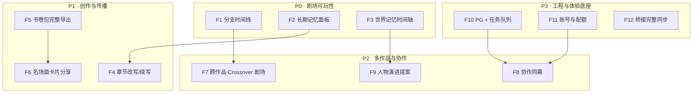

# 造梦空间 · 新功能计划书（v0.3 规划）

> 日期：2026-08-12  
> 基线：M0–M5 已落地（见 [DESIGN.md](../DESIGN.md)）  
> 状态：**F1–F12 已实现并通过 27 项契约/端到端测试**

---

## 0. 规划原则

1. **不平行造契约**：人物包 / 关系 / NDJSON / 书卷包继续沿用造梦定义（ADR-0001）。
2. **先可玩，后工程**：优先提升剧场可玩性与传播；基础设施跟在其后稳住。
3. **每功能可独立验收**：小步交付，能单独演示、单独测试。
4. **安全红线不降**：密钥不落日志、分享默认只读、本地桥接仅 localhost。

---

## 1. 功能地图

---

## 2. P0 — 剧场可玩性（建议第一批）

### F1 会话分支时间线

| 项 | 内容 |
| --- | --- |
| **一句话** | 从任意回合「回到过去」开一条 if 线，时间轴上并排比较多结局 |
| **用户价值** | 「如果当时没有离开」是同人/推演核心乐趣；直接提升重玩率 |
| **现状** | 造梦有 `branch` / `branch-turn`；本产品会话模型仅有 `branch_of` 字段未用 |
| **方案** | ① `POST .../branch-turn` 生成子会话；② 时间轴组件（主线加粗、支线虚线）；③ 节点悬停预览台词；④ 「设为主线」合并操作 |
| **API** | `POST /theater/sessions/{id}/branch`、`GET /theater/sessions/{id}/tree` |
| **UI** | 剧场右侧「时间线」抽屉；节点色区分 status |
| **数据** | `session.branch_of` / `branch_label` / `is_mainline` / `locked_event_ids` |
| **验收** | 从第 N 轮分出 2 条支线，可回放对比，可导出任一支章节 |
| **估点** | 3–4 天 |

### F2 长期记忆面板

| 项 | 内容 |
| --- | --- |
| **一句话** | 可见、可钉选、可禁用的会话记忆列表，影响后续生成 |
| **用户价值** | 角色「记得」关键约定，减少重复解释；防幻觉 |
| **方案** | ① 自动从 complete 事件抽取记忆候选（LLM 单轮）；② 面板列表：category（story/relation/ooc）、pinned、enabled、status(active/stale/conflict)；③ PromptBuilder 注入 pinned+active |
| **API** | `GET/POST/PUT/DELETE .../memories`、`POST .../memory-quality/merge-duplicates` |
| **UI** | 剧场侧栏「记忆」页签；一键钉住/停用 |
| **验收** | 钉住「三日后再会」后，下一回合角色能主动提起 |
| **估点** | 3 天 |

### F3 世界记忆时间轴

| 项 | 内容 |
| --- | --- |
| **一句话** | 世界事实（时间/地点/人物）按时间线展示，可锁定防覆盖 |
| **用户价值** | 长线推演不乱时间；群戏设定一致 |
| **方案** | 复用造梦 `world-memory` 事实模型；横轴 time_hint，纵轴 location；锁定事实优先进提示词 |
| **API** | `GET/POST/PUT/DELETE .../world-memory/facts` |
| **UI** | 剧场「世界」页签：时间轴 + 事实卡片 |
| **验收** | 锁定「旧宅十年前失火」，后续生成不改写该事实 |
| **估点** | 2 天 |

---

## 3. P1 — 创作与传播（第二批）

### F4 章节改写 / 续写

| 项 | 内容 |
| --- | --- |
| **一句话** | 对归档章节下指令改写，或从章节续写新会话 |
| **用户价值** | 写手闭环：推演 → 成稿 → 润色 |
| **方案** | 沿用造梦 `rewrite` / `continue` 语义；改写结果存 revision，可对比/回滚 |
| **API** | `POST /theater/chapters/{id}/rewrite`、`POST /theater/chapters/{id}/continue` |
| **UI** | 章节页双栏 diff；「续写」一键开新剧场 |
| **验收** | 指令「加强环境描写」产出可 diff 的新版本 |
| **估点** | 2 天 |

### F5 书卷包完整导出

| 项 | 内容 |
| --- | --- |
| **一句话** | 导出可被造梦桌面端导入的 `.zaomeng.zip` |
| **用户价值** | Web 推演成果回流桌面 App；社区分享 |
| **方案** | 按 `package_manifest.json` schema_version=1 打包：人物包、关系、可选 dialogue/chapters；校验不含绝对路径与密钥（契约 C-K-04） |
| **API** | `GET /books/{id}/export?include_dialogue=1` |
| **UI** | 书卷页「导出包」按钮 |
| **验收** | 导出包通过契约测试，且 `normalize_package_manifest` 可再导入 |
| **估点** | 2 天 |

### F6 名场面卡片分享

| 项 | 内容 |
| --- | --- |
| **一句话** | 选中连续台词生成竖版/横版名场面卡片图，一键转发 |
| **用户价值** | 传播货币化；截图优于纯链接 |
| **方案** | 前端 Canvas/SVG 模板渲染（角色色带 + 台词）；服务端可选出 PNG（sharp / Pillow）；分享 token 同 F5 |
| **API** | `POST /theater/share/card` → 图片 URL |
| **UI** | 消息多选 →「生成名场面」 |
| **验收** | 生成带角色色带的 PNG，打开分享链接可再看 |
| **估点** | 2–3 天 |

---

## 4. P2 — 多作品与协作（第三批）

### F7 跨作品 Crossover 剧场

| 项 | 内容 |
| --- | --- |
| **一句话** | 多本人物同台：群英会 / 跨书对谈 |
| **用户价值** | 造梦已有 crossover-space（beta）；放大「造梦空间」品牌感 |
| **前置** | F1 分支模型稳定 |
| **方案** | ① 创建 space：title + world_setting + participants[{run_id, character}]；② 提示词注入多方世界观边界；③ 发言归属标注作品色 |
| **API** | `POST /theater/crossover-spaces` |
| **UI** | 新建「群英会」向导；角色徽章带书名 |
| **验收** | 两本书各 1 人同幕 10 轮，OOC 红线可控 |
| **估点** | 4 天 |

### F8 协作同幕

| 项 | 内容 |
| --- | --- |
| **一句话** | 多用户进入同一剧场，轮流发送/共同导演 |
| **用户价值** | 多人脑洞局、线上跑团轻量版 |
| **前置** | F10 队列 + F11 账号 |
| **方案** | 会话成员表 + 角色席位认领；WebSocket/SSE 广播他人回合；乐观并发用 operation_id |
| **API** | `POST /theater/sessions/{id}/members`、广播事件 `peer_turn` |
| **UI** | 席位头像、输入禁用提示、在线状态 |
| **验收** | 两浏览器同幕互见台词，无重复提交 |
| **估点** | 5 天 |

### F9 人物演进提案

| 项 | 内容 |
| --- | --- |
| **一句话** | 根据会话累积，提议人物字段更新（如 trust 变化、新创伤） |
| **用户价值** | 角色「成长」可沉淀回档案，长期一致 |
| **方案** | 对齐造梦 `evolve/proposal` + `evolve/apply`；提案 diff 展示，用户确认后写回 PROFILE 扩展区 |
| **API** | `POST /books/{id}/personas/{name}/evolve/proposal|apply` |
| **UI** | 人物页「演进」标签；字段级 diff |
| **验收** | 20 轮冲突后生成「信任下降」提案，应用后档案可查 |
| **估点** | 3 天 |

---

## 5. P3 — 工程与体验底座（可与 P1 并行）

### F10 PostgreSQL + 任务队列

- **原因**：内存存储重启即失；蒸馏同步阻塞 HTTP。
- **方案**：SQLAlchemy 2 + Alembic 迁移；蒸馏/改写进 Redis + worker（arq）；job 状态与现有 `DistillJobRead` 对齐。
- **验收**：重启不丢书卷；蒸馏 API 立即返回 202，前端轮询进度。
- **估点**：4 天

### F11 账号与配额

- **原因**：防 LLM 滥用；为协作铺路。
- **方案**：匿名房间 + 可选登录（邮箱/魔链）；每用户日蒸馏次数、日回合 token 配额；分享链接可撤销。
- **验收**：超配额返回 429，提示重置时间。
- **估点**：3 天

### F12 桥接完整同步

- **原因**：目前仅 health/runs/sessions 探测。
- **方案**：拉取本机书卷列表 → 只读镜像到 Web；可选「回合双向」（谨慎，默认单向只读）。
- **验收**：桌面造梦有一本书时，Web 书卷列表可见并可开会话。
- **估点**：3 天

---

## 6. 优先级与排期建议

| 批次 | 功能 | 累计估点 | 目标 |
| --- | --- | --- | --- |
| **批次 A（P0）** | F1 + F2 + F3 | ~8–9 天 | 剧场「可玩、记得住、时间不乱」 |
| **批次 B（P1）** | F4 + F5 + F6 | ~6–7 天 | 创作闭环 + 传播 |
| **批次 C（P2）** | F7 + F9（F8 待 F10/F11） | ~7 天 | 跨作品差异化 |
| **批次 D（P3）** | F10 + F11 + F12 | ~10 天 | 可上线运行 |

**推荐路径**：A → B → D → C（协作 F8 在 D 之后）。

---

## 7. 技术约束与风险

| 风险 | 缓解 |
| --- | --- |
| 分支多了提示词爆炸 | 只注入当前路径 transcript + pinned 记忆；分支树懒加载 |
| 记忆抽取噪声 | 候选需用户确认或置信阈值；支持手动改写 |
| Crossover OOC | 强制各角色 ooc_redline 进 system；失败 reset 重试 |
| 协作并发写 | operation_id 幂等 + 会话级锁；先单写者（导演）模式 |
| 导出包泄密 | 导出前扫描 api_key/绝对路径（契约 C-S-01/C-K-04） |

---

## 8. 契约测试增量（摘录）

| ID | 断言 |
| --- | --- |
| C-B-01 | 分支会话 `branch_of` 链可回溯到主线 |
| C-B-02 | 时间线树不超过深度限制时导出章节完整 |
| C-M-01 | pinned 记忆必进出提示词 payload |
| C-M-02 | disabled 记忆不出现在生成上下文 |
| C-E-01 | 导出包再导入后人物数与关系数一致 |
| C-E-02 | 导出包无绝对路径、无 api_key 字段 |
| C-X-01 | Crossover 会话参与者带 `source_book_id` |
| C-C-01 | 协作双写同一 turn 只成功一次 |

---

## 9. 非目标（本阶段不做）

- 移动端原生 App / 小程序
- 视频字幕、TTS 配音（远期）
- 公开 UGC 广场与推荐流
- 自动剧情「通关」式游戏化（避免偏离叙事剧场）

---

## 10. 下一步

1. 评审本计划书，确认批次 A 范围与估点。
2. 落 ADR：分支模型、记忆注入策略。
3. 开工 F1 分支时间线（数据模型 → API → 时间轴 UI → 契约测试）。
